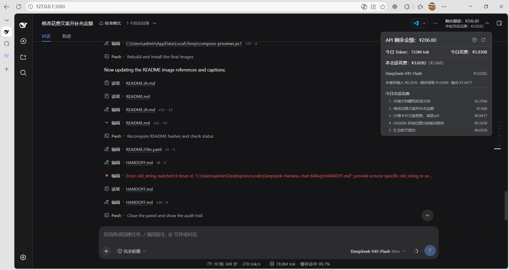
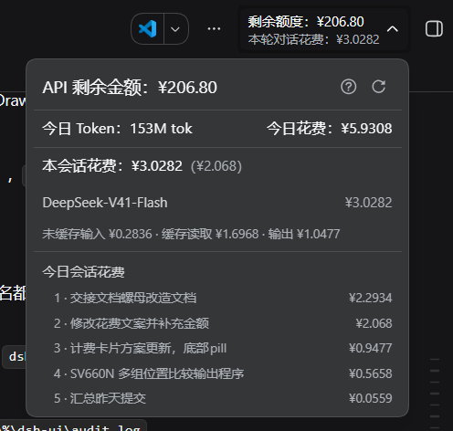
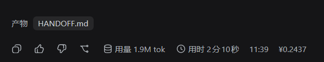

# DeepSeek Harness billing plugin

English | [中文](README.zh.md)

A [DeepSeek Harness](https://github.com/deepseek-ai/deepseek-harness) plugin that shows your **DeepSeek account balance** and **today's total spend across all sessions** directly in the web session header, and **this conversation's own billed spend** on a pill under the composer; each completed turn also shows its **turn cost** as a static amount at the end of the message actions row, and the detail panel ends with a **today session-spend ranking**.

> The balance is the real `GET /user/balance` figure; the session, turn, and today spends price each message's billed tokens at the official peak/off-peak rates and are estimates, not billing promises.

## What it shows

- **Session-header badge** — two lines: remaining balance (`剩余金额：¥X`, the panel's headline without its `API` prefix — the chip is narrow) and today's spend across every session (`今日花费：¥X`, worded exactly as the panel labels it — the chip's second line and the panel's row read the same state, so they cannot disagree). Being account-level, it moves on the day's own reads (mount, refresh, a settled turn, and a panel open) rather than streaming with the turn.
- **Detail panel** — the remaining amount with today's consumption measured from the balance series after it (see *How session spend is computed*); today's billed token count next to today's all-session spend (`今日 Token` / `今日花费`, one row; the count is DSH's compact notation with its own unit — `12.2K tok`, followed by the day's cache-hit share as a bare, unparenthesized percentage, rendered by DSH's own hit-rate rule: an integer percent that grows decimals only as far as a partial hit needs to stay below 100, and none at all when the day billed no prompt-side input); directly under that row, today's two bucket detail lines — tokens on top, costs below, each on its own with its natural ` · ` spacing (no column alignment between them), in the per-model breakdown line's typography but on the third section's row spacing (the today session-spend ranking's tight 6px rhythm); every spend amount renders at **three significant digits** (`¥9.58`) but never finer than four decimals — an amount below ¥0.0001 reads `¥0` — while the balance line alone keeps four decimals; and a manual refresh action and a spend disclaimer on the `?` button (one line of estimate scope, then a line stating that a conversation's amount includes the subagent sessions it delegated, and the running plugin version as the last line, e.g. `v0.3.13`). The panel ends with a **today session-spend ranking**: sessions sorted by today's spend, highest first — one row per conversation, since each subagent session's spend is merged into the row of the session that delegated it (names come from the log's Chinese titles and follow renames automatically; at most the top 10 rows, with a "…N more sessions" hint).
- **Turn cost amount** — each completed turn's closing message shows a plain static `¥X` at the **end** of the actions row, after the clock: non-interactive (no icon, no "cost" word, no card), its typography replicates the clock text (13px secondary tier, tertiary tone, nowrap), and it is **always visible** (not hover-revealed like the clock text — the row's own hover reveal shows both together); turns without DeepSeek usage (zero cost) or failed loads stay hidden.
- **Composer spend pill** — the composer's own stat row (the one DSH's time/token pills sit in) carries one more entry: this plugin's ring-and-sparkle mark plus this conversation's billed spend, at the same three-significant-digit precision as the badge, opening a cost card whose three rows are the spend's three billing buckets (uncached input / cached input / output) under DSH's own token-card wording. Its amount is the **conversation's** — this session plus the subagent sessions it delegated, merged by the same rule the host's own sums use; it is the ONLY surface that shows the conversation's own spend (the badge's second line and its panel report the day), so a session that priced nothing anywhere shows no pill, while one that priced nothing itself but delegated a priced subagent still shows.
- **Failures and empty states** — a session or day without priced usage shows "no usage recorded" instead of a fabricated figure; a missing key, rejected credential, or transport error renders a muted "Balance unavailable" chip, and an API key the API reports without any spendable balance renders the ordinary chip with a `—` amount. Both open the detail panel, whose first row explains the `—` in one short localized sentence (check the API key, or that the key holds no balance — the Remote's verbatim English message is not rendered) and which keeps the refresh action; today's spend is read from the session logs, so it stays on the chip and in the panel either way.

## Data update mechanics

- **Session spend follows the conversation** — the host prices every committed event into a per-session projection (`billingTodaySpend`) and pushes it to the browser, so **this conversation's own spend** updates live with no Remote call — on the composer pill, the surface that shows it; the Remote read remains the fallback when the projection registry is absent, and `billing/getDelegatedSpend` adds the subagent sessions this session delegated (fetched on mount, on a session switch, on refresh, and when a turn settles) so the amount shown is the whole conversation's. **Today's spend** — the badge's second line and the panel's row — is recomputed on turn settle (one shared scan serves the aggregate and the ranking); each turn's cost comes from **one batch fetch per session** instead of one call per rendered message.
- **A session switch re-reads only the session's own lines** — the balance and today's spend do not vary by session, so they are not re-fetched when you switch; only `billing/getSessionSpend` and `billing/getDelegatedSpend` are. A **settled turn and the manual refresh ask for a fresh day figure** (`force`), so the day row never reports a turn's cost a turn late; **opening the detail panel** re-reads the day row too, so browsing sessions while idle cannot leave it behind. A plain read of the day cache is answered from the last value at once, with the scan running behind it — so nothing the user did not just cause ever waits on the day's all-session scan.
- **Balance is cached and polled** — the host reuses one `/user/balance` snapshot for 15 seconds (manual refresh forces a fresh one) and caps each request at 5 seconds; the browser keeps the last settled value so a session switch renders the amount immediately, and polls every 5 minutes while the page is visible (paused while the document is hidden, refreshed once on return) — the balance-series consumption below is measured from the first balance each local day samples, so that cadence is its resolution.
- **Old values survive refreshes** — a failed refresh keeps the last good value instead of blanking it.

## Preview

A real session: the session-header badge and the open detail panel:



Close-up of the detail panel — the `API 剩余金额` figure, `今日 Token` and `今日花费`, today's bucket detail lines (`未缓存输入 · 缓存读取 · 输出`), and the today session-spend ranking:



Close-up of the turn-cost amount — the static `¥` amount at the end of the actions row, after the clock:




## Package layout

| Package | Side | Role |
| --- | --- | --- |
| [`packages/llm-billing`](packages/llm-billing) — `@rayadesu/dsh-llm-billing` | Host | Owns the `/user/balance` transport and the peak/off-peak pricing table. Exposes the `billing` Remote (`getBalance(force?)`, `getSessionSpend`, `getTodaySpend`, `getTodaySessionsSpend`, `getTurnSpend`, `getSessionTurnSpends`) and registers the client-visible `billingTodaySpend` projection unit. |
| [`packages/ui-billing`](packages/ui-billing) — `@rayadesu/dsh-client-ui-billing` | Browser | Mounts the `billing` Remote itself and contributes the session-header badge and detail panel, plus the static turn-cost amount at the end of the message actions strip and the spend pill in the composer's stat row (beside the built-in token pill; its amount is this session plus the subagent sessions it delegated). |

### Plugin manager display metadata

The sidebar's **Plugins** page and the **Settings → Plugins** list show each entry's title, description, and icon. Both come from files inside the package itself — the host reads no plugin code:

- `locale/en.json` and `locale/zh.json` — `{"meta": {"title": …, "description": …}}`, resolved against the active interface language and falling back to English.
- `icon.svg` — a self-contained SVG (no external font or image references; it renders through an `` data URL) declared as the package's top-level `icon` field. The entry's rounded tile is drawn by the page (dark: `#151517` on a `#3b3b3c` border; light: white on a light border), so the icon itself must stay **transparent** — bake no background plate, or it turns into a dark square in the light theme.

Both are reached through the package's `exports` map, so a package that declares `exports` must also export `./locale/*.json`: without it the locale files are silently dropped and the entry falls back to its bare package name. Each of the three packages carries its own pair of locale files and its own icon.

## Prerequisites

- **DeepSeek Harness** (`dsh`) — the plugin runs inside a dsh profile.
- **A DeepSeek API key** — the balance is read from the DeepSeek API, so every user needs their own key.

## Installation

### Install from the Web plugin page (official)

The three packages are published to npm under the `@rayadesu` scope. The bundle
declares the two plugin packages as its regular `dependencies`, so **one package
name installs everything**: pnpm pulls the bundle's dependency closure into the
profile, where the hoisted `node_modules` makes the two row names resolvable.

1. In the sidebar open **Plugins** → **Add plugin**.
2. Enter `@rayadesu/dsh-billing`. The npm registry is the supported install
   source: the bundle arrives as a real package and pnpm resolves its two
   `dependencies` alongside it. The dialog also accepts a GitHub repository
   address or a local directory path, but a bundle installed that way does not
   bring the two plugin packages — pnpm installs no dependencies of a linked or
   git-hosted package, so the profile keeps the bundle alone and startup reports
   `2 entries did not activate llm-billing … failed to import`.
3. Pick an install source (the default npm registry or the **Mainland China
   mirror**), press **Install**, then **Enable now**.

### Install with the CLI

The `dsh` command you use depends on how dsh is installed:

- **Global install** — use the global `dsh` from anywhere:

  ```bash
  dsh plugin --profile web add @rayadesu/dsh-billing
  ```

- **Source-built dsh** (a deepseek-harness checkout) — the CLI only resolves from
  the source directory, so run it through pnpm there (`pnpm dsh` is the
  harness-local binary, equivalent to the global `dsh`):

  ```bash
  cd deepseek-harness
  pnpm dsh plugin --profile web add @rayadesu/dsh-billing
  ```

### pnpm 11 release-age gate

A dsh profile installs plugins through pnpm, and pnpm 11's supply-chain
release-age gate does not pick up packages younger than 24 hours by default —
a freshly published version is therefore not resolved immediately. To get the
latest version right after a publish:

- Disable the age gate in the profile's pnpm config:

  ```yaml
  # ~/.dsh/profiles/web/pnpm-workspace.yaml
  minimumReleaseAge: 0
  ```

- Or, within the 24-hour window, install with explicitly pinned versions (an
  explicit pin bypasses the age gate; pin all three names — the bundle's two
  plugin packages install transitively and need their own pin to pass the gate;
  replace `0.3.0` with the version you want; from a source checkout, use
  `pnpm dsh …` as above):

  ```bash
  dsh plugin --profile web add @rayadesu/dsh-billing@0.3.0 @rayadesu/dsh-llm-billing@0.3.0 @rayadesu/dsh-client-ui-billing@0.3.0
  ```

Manual rows (only when you do not want the bundle):

```yaml
# ~/.dsh/profiles/web/cordis.patch.yml
- insert:
    - id: llm-billing
      name: '@rayadesu/dsh-llm-billing'
    - id: ui-billing
      name: '@rayadesu/dsh-client-ui-billing'
```

### Common commands

Global `dsh` is assumed; a source-built dsh uses `pnpm dsh` from the
deepseek-harness checkout instead — the subcommands are identical.

```sh
dsh plugin --profile web list    # list the web profile's installed plugins
dsh plugin --profile web add @rayadesu/dsh-billing
dsh plugin --profile web remove @rayadesu/dsh-billing
dsh plugin --profile web update  # update plugins to the latest allowed versions
dsh plugin --profile web update --latest  # ignore declared ranges; upgrade every plugin to its newest published version
```

Both commands take the bundle alone — its two plugin packages travel with it as
dependencies. A profile installed by the older three-package command lists all
three in its `package.json`, and pnpm only removes names listed there: on such
a profile, give `remove` all three names to clear the leftovers.

`update` respects the version ranges in the profile's `package.json`, so it
stays within the semver range each plugin declares. Adding `--latest` (a pnpm
`update` flag) instead ignores those ranges and upgrades every plugin to its
newest published version — the way to pick up a fresh release immediately once
it is resolvable. From a source-built dsh checkout you run it as
`pnpm dsh …` in the deepseek-harness directory, exactly as with the other
commands.

### Dependency notes

The two plugin packages declare the DeepSeek Harness packages they build on
(`@deepseek-ai/cordis`, `@deepseek-ai/dsh-credentials`, `@deepseek-ai/dsh-session`,
and the client runtime packages) as `peerDependencies` at `^0.2.0-rc.1`. A dsh
profile does not auto-install peers, so these are provided by the dsh
installation itself through the `profiles/node_modules` fallback rather than
fetched from the registry — no extra packages to install, and no registry token
needed on the installing machine.

Two of those published client packages import runtime modules their manifests
list only under `devDependencies` (`dsh-client-store` → `zustand`/`immer`;
`dsh-client-ui-primitives` → the markdown view stack: `mdast-util-*`,
`micromark-*`, `shiki`, `katex`, `diff`, `anser`, `clsx`, `simple-icons`;
`dsh-client-web` → `dsh-client-ui-dockkit`, which its manifest does not declare
at all). The shipped bundles
are external and load them from the dsh installation at runtime, but this
standalone workspace resolves them itself, so `ui-billing` declares them as its
own `devDependencies` for the browser-half specs.

The plugin builds against the 0.2.0-rc.1 published line and keeps both DSH
runtime families readable: the live `Session` log surface
(`Session.events` + `header.seedLength` at/before 0.1.1-rc.2,
`snapshotEvents()` + `inheritedEventCount` since 0.1.2-alpha.4), and the
persistence service surface (`inspect`/`listSnapshots` at/before 0.1.1-rc.2,
`open`+`SessionHandle`/`list` on the 0.1.2-alpha.5 handle-based seam — the
checkout master that ships the refactor). The projection unit's `init` is
declared with the newer metadata parameters and stays callable as the older
zero-arg shape.

The browser-half tests exercise the published client bundles through the
module-loader shim; since the 0.1.2-alpha.5 client stack split the runtime out
of `dsh-client-runtime` (deleted) into `dsh-client-store`,
`dsh-client-ui-session`, `dsh-client-ui-chat`, and the renderer-owned
`SlotRegistry`, the test harness re-checks registered bundle exports after a
fallback require and pins react copies with a resolve alias. The `assistant-actions`
slot row moved from ui-conversation to ui-chat, so the plugin's client half
pulls the ui-chat type merge too.

### Configure your DeepSeek API key

Either fill it in on the web "Models" page (writes `DEEPSEEK_API_KEY` into `~/.dsh/.credentials.yaml`), or export it:

```bash
export DEEPSEEK_API_KEY=sk-...
```

### Restart

```bash
dsh web
```

## Development

This repository is a standalone pnpm workspace: the plugin packages resolve the
`@deepseek-ai/*` peer packages from npm, so building does not need a full
DeepSeek Harness checkout.

Requirements: Node `^22.19 || >=24` and pnpm.

```sh
pnpm install                 # installs workspace and npm dev dependencies
pnpm run build               # host face (tsc + tsdown + typert artifacts), then client face
pnpm run typecheck           # both compile faces
pnpm run test                # vitest unit/browser tests
pnpm run verify              # pre-publish gate (also runs via prepublishOnly)
```

The host pass regenerates `lib/typert.host.js` and `lib/typert.remote-client.*`
from the package source, keyed by each package.json name; the client pass
rebuilds `lib/client.js`. `lib/` is git-ignored build output — do not hand-edit
it. If a typert manifest ever names a package other than its own
(`TYPERT.package` !== package.json name), the `verify` gate fails before publish.

The typert generator recognizes `Remote`/`TypertRemoteService` only from a
workspace-registered protocol package, so `packages/typert-protocol` vendors
the published `@deepseek-ai/dsh-typert-protocol@0.2.0-rc.1` declarations; when
the dsh dependency line moves, refresh it from the installed package.

The generated codecs must carry a `create` factory: the `dsh-typert-loader`
refuses any strict codec without one (`... parameter codec has no create()
factory`), which fails the host line's activation. Generator 0.1.7+ emits
`create` natively, so a current build passes through unchanged;
`scripts/typert-compat.mjs` — run at the end of `build:host`, enforced by
`verify` — stays as a safety net that exits non-zero if a codec ever ships
without its factory. Run `pnpm run build:host` (not bare `tsdown`) after
touching anything that regenerates these artifacts.

Publishing (the bundle and both plugins share one version; `prepublishOnly`
runs the `verify` gate automatically). Use `npm publish` from **inside each
package directory** — `pnpm publish` fails (token resolution) and a folder
argument like `npm publish packages/llm-billing` is parsed as a GitHub
shorthand, which triggers a bogus `git ls-remote` instead of a publish. The
registry requires a token that bypasses 2FA (an `npm login` session token gets
E403).

**Configure the token once, so it never appears in a command** — put one line
in `~/.npmrc` referencing an environment variable, which npm expands at
publish time:

```ini
//registry.npmjs.org/:_authToken=${NPM_TOKEN}
```

Then set the variable and `npm publish` plainly — the token is in no argument
and stays out of shell history:

```sh
export NPM_TOKEN=<your npm token>
cd packages/llm-billing && npm publish
cd packages/ui-billing && npm publish
npm publish   # @rayadesu/dsh-billing bundle (repo root)
```

(Alternatively write the real token directly into `~/.npmrc`, e.g.
`npm config set //registry.npmjs.org/:_authToken <TOKEN>`; the commands then
carry no token either. Either way, **never commit the token**.)

## Configuration

Both packages ship sane defaults; everything below is optional.

### Host (`llm-billing`)

| Field | Default | Meaning |
| --- | --- | --- |
| `apiKeyEnv` | `DEEPSEEK_API_KEY` | Credential-reference (environment-variable) name resolved per call. |
| `baseURL` | `$DEEPSEEK_BASE_URL` then `https://api.deepseek.com` | Endpoint base; `/user/balance` is appended. |
| `models` | V4.1 Flash (`deepseek-flash`) + V4 Flash + V4 Pro + V4 Flash Vision Exp + MiMo-V2.5/V2.6 series | Advisory display rows, in presentation order; they mirror DSH's `llm-deepseek` catalog. |
| `billing.peakHours` | 09:00–12:00, 14:00–18:00 (Beijing, weekdays) | Peak-hour windows, applied weekdays (Mon–Fri) only; weekends and all other hours are off-peak. |
| `billing.models` | Published V4 + MiMo rates | Per-model price rows (`cacheHitInput`, `cacheMissInput`, `output`, in CNY per 1M tokens) with an optional inclusive `effectiveFrom`; several rows sharing a model are its rate revisions. |

## How session spend is computed

- Each `assistant/message` event reports three billed token buckets: **cache-hit input**, **cache-miss input** (uncached input + cache writes), and **output** (including reasoning). A failed or retried `assistant/attempt` reports its usage only in its embedded stream; that sample is priced too (with the model of the latest `request/header`), a later sample for the same `(turn, step)` **replaces** the earlier one, and `llm/retry-started` makes the retried attempt **add** — the same accounting DSH's own turn-usage disclosure uses.
- Each sample is priced at the peak/off-peak rate of its own **Beijing-time** hour — and of the rate revision in effect at its own timestamp — the three buckets are billed separately (`未缓存输入 ¥X · 缓存读取 ¥Y · 输出 ¥Z`, DSH's own bucket names), then summed per model. Peak windows apply weekdays (Monday–Friday) only; weekends are always off-peak.
- **Today's spend** aggregates every session's events on the current Beijing-time calendar day with the same pricing rules; **today's tokens** is the sum of those same priced rows' three billing buckets (cache-hit input / cache-miss input / output), rendered in DSH's compact notation with its ` tok` unit (`517 tok`, `12.2K tok`, `1.2M tok`); event dates are also assigned in Beijing time.
- **Turn cost** prices the events inside the turn's `turn/start`..`turn/end` range with the same rules (located by the closing message's session id + message id), folded in one pass for the whole session and served as a `messageId → cost` map.
- **Today session ranking** aggregates today's spend per session with the same rules (a cross-day session counts only today's part), sorted descending; names come from the log's latest `session/title` event (the auto-generated Chinese title or a user rename). It ranks **conversations**: a subagent session (DSH stamps its header with `origin: 'subagent'` and a `delegationDepth`; a user fork carries neither) is merged into the row of the top-level session that delegated it, so one row is one conversation. Each row reports `total` (the conversation's whole day, subagents included) plus `ownTotal` (that session's own spend); the day's aggregate total is unchanged by the regrouping.
- An unlisted model is NEVER priced by inference: no rate row means no price. The usage is recorded as `unpriced` instead and warned about once per model, so a new upstream model shows ¥0 WITH the model named as the reason rather than as an ordinary empty day — which is exactly how MiMo-V2.6 looked before its rows existed. Model ids are chosen by whoever ships the model, so a similar-looking name is no basis for a price; add one row under `billing.models` instead. The built-in table covers the DSH `llm-deepseek` catalog — V4.1 Flash `deepseek-flash`, V4 Flash, V4 Pro, V4 Flash Vision Exp — plus the retired `deepseek-v4.1-flash-expires-on-0910` preview id and the MiMo-V2.5/V2.6 series; every flash-series route shares the same pair). Each sample takes the rate revision in effect at its own timestamp: the base schedule is the DeepSeek pricing effective **August 17**; the **flash series** (V4.1 Flash, V4 Flash, V4 Flash Vision Exp, and the retired id) was re-priced effective **September 10, 12:00 Beijing time** to off-peak 0.02 / 1.0 / 4.0 CNY per 1M tokens with peak at twice those prices — samples from before that instant, the V4.1 Flash route's own earlier usage included, keep the superseded rates; the **V4 Pro** route is announced to switch to V4.1 Flash and its rates on **September 14, 12:00 Beijing time**; the MiMo series is untouched (MiMo-V2.6 — launched September 22, 2026 — kept V2.5's published rates and ships the same rows). The weekend-off-peak rule (weekends billed at off-peak prices all day) follows the adjustment effective **August 23**.

- **The balance-series "today's consumption"** (the figure right after `API 剩余金额`) is pure account arithmetic and never enters the token pricing above: the first balance queried on the local calendar day − the current balance + the day's detected top-ups (an increase rounds **up to the next ¥10 step**, because the provider only tops up in round tens). It is the caliber of the `balanceinfo` program this plugin mirrors, and it is deliberately a separate figure from the priced 今日花费 — spend from another client, or from before this browser was opened, shows up only here; the two figures disagreeing is normal. The day record lives in this browser's `localStorage` (key `dsh.billing.balance-day.v1`), survives reloads and `dsh` restarts, rolls over on the **local** calendar day (the browser's day, not the host's Beijing day key), is sampled on mount, on session switch, on the manual refresh, and every 5 minutes while the page is visible, renders only once the day holds a sample, and is not shared between clients. Details in [`packages/ui-billing/README.md`](packages/ui-billing/README.md).

## Known limitations

- **Priced rows only** — the session, turn, and today spends only price models that have a `billing.models` row (today's token count reads those same rows, so it covers priced models only).
- **On-demand aggregation** — today's spend and the session ranking are computed on the host behind a 60-second cache and share ONE scan; a miss resolves live sessions from their eager projection cells and cold sessions from the zero-I/O projection-cache row when that row's own day is not the queried one, reading a log only for sessions whose persisted revision changed (or whose cached row covers the queried day). A failed resolution is remembered by revision instead of being retried every scan. The ranking's subagent roll-up regroups those rows in the same pass, with no extra read, and the aggregate still sums every session — so merging never moves money. The ranking is also fetched only on demand — see the next bullet.
- **Ranking is fetched on demand** — the panel loads the ranking when it is opened (and on refresh), so a badge that stays closed never pays for the all-session scan; the ranking can be up to 60 seconds behind afterwards.
- **The delegated subtotal moves with the turn, not per event** — the pill's own part is live (pushed projection), while the subagent part comes from `billing/getDelegatedSpend`, refreshed on mount, on a session switch, on manual refresh, and when a turn settles, and served from the same 60-second host cache as today's spend. A subagent that burns money mid-turn therefore lands on the conversation's amount at the next read (turn settle, refresh, or a session switch), not per event.
- **The badge's second line is not live per turn** — today's spend is account-level and has no pushed projection behind it, so the line moves on mount, on the manual refresh, on a panel open, and when a turn settles (debounced ~2s); the composer pill, which reads the pushed projection, is the surface that streams with the turn.
- **A merged row can be untitled** — a subagent whose parent session is outside the scan (a deleted or archived parent log, for instance) is still attributed to the parent id its own header names, but that log is never read, so the merged row shows the untitled fallback until the parent is scanned.
- **Ranking capped at 10** — the panel shows at most the top 10 conversations (the host's subagent roll-up runs first, so one row is one conversation), with a "…N more sessions" hint.
- **Turn cost needs a finalized closing message** — interrupted turns have no actions row, so no turn cost; cold sessions served straight from the projection cache may rank with an "Untitled" name until their log is read again.
- **Balance is up to 15s stale between polls** — the host reuses one snapshot for up to 15 seconds and each request aborts after 5 seconds; spending from another client moves the shown value at the next poll (5 minutes while the page is visible, none while it is hidden), at a manual refresh, or at a browser reload.
- **Estimate, not a promise** — the session spend prices tokens at official rates; the provider's actual billing prevails.

## License

[MIT](LICENSE)
