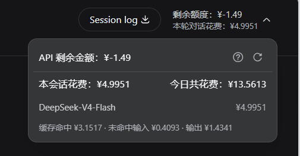

# DeepSeek Harness 计费插件

[English](README.md) | 中文

一个 [DeepSeek Harness](https://github.com/deepseek-ai/deepseek-harness) 插件，在 Web 会话头部直接显示你的 **DeepSeek 账户余额**、**当前会话（本轮对话）的花费**，以及**今日所有会话的共花费**。

> 余额是 `GET /user/balance` 的真实数字；会话花费与今日共花费是按官方峰/谷单价对每条消息的计费 token 逐条计价的结果，不是计费承诺。

## 显示什么

- **会话头部徽标** —— 两行：剩余余额（`剩余额度：¥X`）＋ 本轮对话的计费花费（`本轮对话花费：¥X`）。
- **详情面板** —— 剩余金额、本会话花费（`本会话花费`）与其右侧的今日所有会话共花费（`今日共花费`），以及每个模型一行的花费分项（`缓存命中 ¥X · 未命中输入 ¥Y · 输出 ¥Z`），外加手动刷新按钮与花费说明。
- **失败与空态** —— 会话或今日没有可计价消耗时显示「暂无消耗记录」而不是编造数字；未配置 key、凭据被拒或传输错误时显示弱化的「额度不可用」，其提示携带 Remote 自己的错误信息。

## 数据更新机制

- **会话花费自动跟随** —— 当前会话每到达一条新消息，徽标就只重算**本会话的花费**与**今日共花费**（纯本地计价，不发网络请求），连续对话时花费会实时跟着走。主机端按增量计价：会话日志未变化时直接命中主机端缓存，日志增长时只重算新增的尾部。
- **额度保持手动** —— 余额是账户级数据，只在挂载、切换会话、手动点刷新、或刷新浏览器时重新查询 `/user/balance`；**没有轮询**，不会自动跟随账户变化。
- **刷新期间旧值保留** —— 刷新失败保留上一次有效值，不会清空。

## 显示样式



## 包结构

| 包 | 侧 | 作用 |
| --- | --- | --- |
| [`packages/llm-billing`](packages/llm-billing) —— `@rayadesu/dsh-llm-billing` | 主机端 | 负责 `/user/balance` 传输与峰/谷计价表。对外暴露 `billing` Remote（`getBalance`、`getSessionSpend`、`getTodaySpend`）。 |
| [`packages/ui-billing`](packages/ui-billing) —— `@rayadesu/dsh-client-ui-billing` | 浏览器端 | 自己挂载 `billing` Remote，并贡献会话头部徽标与详情面板。 |

## 前置条件

- **DeepSeek Harness**（`dsh`）—— 插件运行在 dsh profile 内。
- **一个 DeepSeek API key** —— 余额从 DeepSeek API 读取，所以每个用户都需要自己的 key。

## 安装

> 📌 **仓库说明**：本仓库是插件的**唯一分发来源**——deepseek-harness 官方仓库
> （[deepseek-ai/deepseek-harness](https://github.com/deepseek-ai/deepseek-harness)）
> **不含**计费插件；插件曾短暂集成于本用户的 fork，现已回退到官方提交版本
> （`141eb6fef8`），本仓库不再依赖任何 fork。

### 安装（已发布到 npm，一条命令）

三个包已发布到 npm 的 `@rayadesu` scope。一条命令同时安装 bundle 与两个插件包
（bundle 把两个插件包声明为 peer 依赖，而 profile 默认不自动安装 peer，所以要显式列出）：

```bash
dsh plugin --profile web add @rayadesu/dsh-billing @rayadesu/dsh-llm-billing @rayadesu/dsh-client-ui-billing
```

手动补行（仅当不想用 bundle 时）：

```yaml
# ~/.dsh/profiles/web/cordis.patch.yml
- insert:
    - id: llm-billing
      name: '@rayadesu/dsh-llm-billing'
    - id: ui-billing
      name: '@rayadesu/dsh-client-ui-billing'
```

### 依赖说明

两个插件包把它们依赖的 DeepSeek Harness 包（`@deepseek-ai/cordis`、
`@deepseek-ai/dsh-credentials`、`@deepseek-ai/dsh-session` 以及客户端运行时包）
声明为 `peerDependencies`（`^0.1.1-rc.2`）。dsh profile 默认不自动安装 peer，所以
这些由 dsh 安装本身通过 `profiles/node_modules` 回退提供，而不是从 registry 拉取——
无需额外安装，安装机也不需要 registry token。

### 配置你的 DeepSeek API key

二选一：在网页「模型」页填入（会把 `DEEPSEEK_API_KEY` 写入 `~/.dsh/.credentials.yaml`），或导出环境变量：

```bash
export DEEPSEEK_API_KEY=sk-...
```

### 重启

```bash
dsh web
```

## 开发

本仓库是独立的 pnpm workspace：两个插件包从 npm 解析 `@deepseek-ai/*` peer 包，
构建不需要完整的 DeepSeek Harness checkout。

环境要求：Node `^22.19 || >=24` 与 pnpm。

```sh
pnpm install                 # 安装 workspace 与 npm 开发依赖
pnpm run build               # host 面（tsc + tsdown + typert 产物），再 client 面
pnpm run typecheck           # 两个编译面
pnpm run test                # vitest 单元/浏览器测试
pnpm run verify              # 发布前校验（prepublishOnly 也会自动运行）
```

host 面会从源码重新生成 `lib/typert.host.js` 与 `lib/typert.remote-client.*`，
包名取自各 package.json；client 面重建 `lib/client.js`。`lib/` 是 git-ignored
的构建产物，不要手工修改。一旦 typert 清单里的 `TYPERT.package` 与 package.json
的 name 不一致，`verify` 会在发布前直接失败。

typert 生成器只认工作区内已注册协议包里的 `Remote`/`TypertRemoteService` 声明，所以
`packages/typert-protocol` 内嵌了 npm 上 `@deepseek-ai/dsh-typert-protocol@0.1.1-rc.2` 的
声明文件；dsh 依赖线升级时，从安装包重新刷新它。

发布（bundle 与两个插件包统一版本号）：

```sh
pnpm --filter @rayadesu/dsh-llm-billing publish --access public
pnpm --filter @rayadesu/dsh-client-ui-billing publish --access public
pnpm publish --access public   # @rayadesu/dsh-billing bundle
```

## 配置

两个包都有合理默认值，下面都是可选的。

### 主机端（`llm-billing`）

| 字段 | 默认 | 含义 |
| --- | --- | --- |
| `apiKeyEnv` | `DEEPSEEK_API_KEY` | 每次调用时解析的凭据引用（环境变量）名。 |
| `baseURL` | `$DEEPSEEK_BASE_URL`，其次 `https://api.deepseek.com` | 端点基础地址；会追加 `/user/balance`。 |
| `models` | V4 Flash + V4 Pro + V4 Flash Vision Exp | 展示用的模型行，按展示顺序。 |
| `billing.peakHours` | 09:00–12:00、14:00–18:00（北京，仅工作日） | 高峰时段窗口，仅周一至周五适用；周末与其余时段均为低谷。 |
| `billing.models` | 官方 V4 费率 | 每个模型的峰/谷单价行（`cacheHitInput`、`cacheMissInput`、`output`，单位：元/百万 token）。 |

## 会话花费是怎么算的

- 每条 `assistant/message` 事件报告三个计费 token 桶：**缓存命中输入**、**未命中输入**（未缓存输入 + 缓存写入）、**输出**（含推理）。
- 每条消息按其**发生时刻（北京时间）**所在的峰/谷时段单价计价，三个桶分别计费（`缓存命中 ¥X · 未命中输入 ¥Y · 输出 ¥Z`），再按模型汇总。高峰窗口仅周一至周五适用；周末全天按低谷价计费。
- **今日共花费**按同一个计价规则汇总当天（北京时间自然日）所有会话的事件；事件归属的日期同样按北京时间计算。
- 没有费率行的模型不计入（内置价目表目前含三个 V4 行：V4 Flash、V4 Pro、V4 Flash Vision Exp）。计费按 DeepSeek **8 月 17 日实行**的费率；**周末按低谷价计费**的规则按 **8 月 23 日**生效的调整执行。

## 已知限制

- **有费率行才计价** —— 会话花费与今日共花费只统计价目表（`billing.models`）里有的模型。
- **按需读取** —— 今日共花费每次刷新都会读取所有会话的完整事件日志，成本随总日志大小增长。
- **额度不自动跟随** —— 余额保持手动刷新（无轮询），账户在其他客户端产生消耗时，界面值不会自动变化，需手动刷新或刷新浏览器。
- **是估算，不是承诺** —— 会话花费按官方单价对 token 计价；实际计费以服务商为准。

## 许可证

[MIT](LICENSE)
