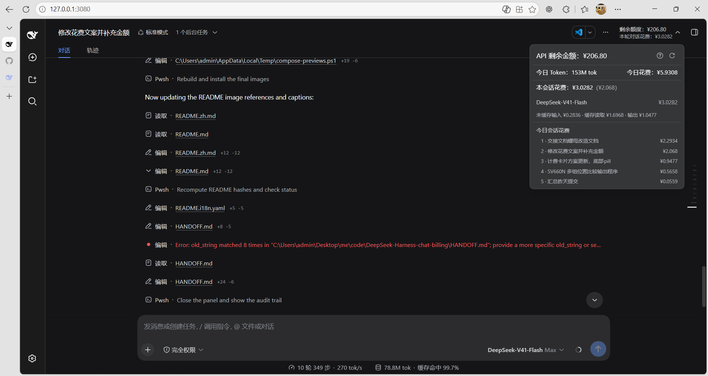
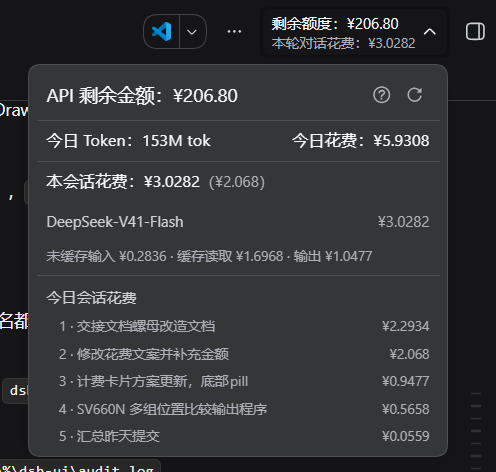
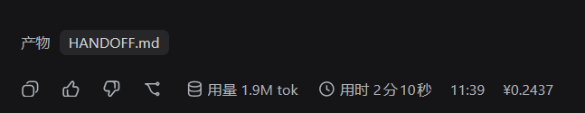

# DeepSeek Harness 计费插件

[English](README.md) | 中文

一个 [DeepSeek Harness](https://github.com/deepseek-ai/deepseek-harness) 插件，在 Web 会话头部直接显示你的 **DeepSeek 账户余额**、**当前会话（本轮对话）的花费**，以及**今日所有会话的共花费**；每条已完成的回合还会在消息操作行**行尾**以静态金额显示**本轮花费**，详情面板底部带**今日各会话花费排行**。

> 余额是 `GET /user/balance` 的真实数字；会话花费、本轮花费与今日花费是按官方峰/谷单价对每条消息的计费 token 逐条计价的结果，不是计费承诺。

## 显示什么

- **会话头部徽标** —— 两行：剩余余额（`剩余金额：¥X`，是面板标题去掉 `API` 前缀的短版，徽标较窄）＋ 本轮对话的计费花费（`本会话花费：¥X`，含本次对话委派的每个子代理会话，文案与面板完全一致）。
- **详情面板** —— 剩余金额（后跟按余额序列算出的今日消费，见「会话花费是怎么算的」）；今日计费 token 数与今日所有会话合计同一行（`今日 Token` / `今日花费`，token 数按 DSH 的紧凑记数法带自己的单位，如 `12.2K tok`，token 数值后紧跟当天的缓存命中率（裸数字、无括号）——按 DSH 官方命中率规则渲染：整数百分比，只有部分命中会被凑到 100% 时才逐位多留小数；当天没有 prompt 侧输入就不显示）；紧跟该行下面是**今日两行桶明细**——token 在上、花费在下——两行各自成行、各自保持自然的 ` · ` 间距（两行之间不做列对齐），排版沿用下方模型分项那一套，行距用第三部分（今日会话花费排行）那一套紧凑节奏；**面板上所有花费金额都按三位有效数字渲染**（`¥9.58`），但**不细于四位小数**——低于 ¥0.0001 的金额显示 `¥0`；只有余额行保留四位小数；下一行才是本会话花费（`本会话花费`——本会话加上它委派的子代理会话，模型分项同样合并；金额后**只在这段对话不是今天才创建时**才紧跟今日份金额 `¥X`——判定用的是会话自身的创建日（子代理读取给出 `crossedDay`），不再比较两个金额，因为实时的本会话数字与 60 秒缓存的排行行在回合中途本来就会不一致；以及每个模型一行的花费分项（用 DSH 自己的桶名与行序：`未缓存输入 ¥X · 缓存读取 ¥Y · 输出 ¥Z`），外加手动刷新按钮与「?」上的花费说明（一句估算口径，一行说明金额含本会话委派的子代理会话，一行说明紧跟的金额是本次对话今日花费，最后一行顶格是当前插件版本号，如 `v0.3.13`）；面板底部是**今日会话花费排行**：按今日花费从高到低排列的会话列表——一行就是一个对话，子代理会话的花费已并入委派它的那个会话行（会话名取日志中的中文标题，重命名后自动同步；最多显示前 10 条，其余以「…还有 N 个会话」提示）。
- **本轮花费金额** —— 每条已完成回合的收尾消息操作行**行尾**（时钟之后）显示纯静态的 `¥X`：不可点击、无图标、无「花费」字样、不弹卡片，字体样式逐项复刻时钟文本（13px 次级字号、tertiary 色、nowrap），并且**始终显示**（不随悬停隐藏，与时钟文本一致——整行的悬停显隐规则让两者同进退）；回合没有 DeepSeek 用量（花费为 0）或加载失败时不显示。
- **失败与空态** —— 会话或今日没有可计价消耗时显示「暂无消耗记录」而不是编造数字；未配置 key、凭据被拒或传输错误时显示弱化的「额度不可用」，其提示携带 Remote 自己的错误信息。

## 数据更新机制

- **会话花费自动跟随** —— 主机端把每条已提交事件计价进每会话投影（`billingTodaySpend`）并推送给浏览器，**本会话自身的花费**因此零 Remote 调用、实时更新；投影注册表不存在时回退到 Remote 读取，而 `billing/getDelegatedSpend` 再把本会话委派的子代理会话加上去（挂载时、切换会话时、手动刷新时与回合结束时各拉一次），所以显示的是整次对话的金额。**今日花费**（与同一行的**今日 Token**）在回合结束时重算（聚合、排行与子代理小计共用同一次扫描），本会话花费行紧跟的今日份金额也来自这次排行读取（不额外发请求，代价是与排行同进同退）；每条消息的行尾金额来自**每会话一次批量拉取**，不再逐条消息各发一次请求。
- **切会话只重取会话自己的两条线** —— 余额与今日花费都不随「切到哪个会话」变化，所以切换时不再重取，只有 `billing/getSessionSpend` 与 `billing/getDelegatedSpend` 会重发。**回合结束与手动刷新会带 `force` 要一个新值**，所以今日行不会把上一轮的花费拖到下一轮才显示；**打开详情面板**也会补读今日行，因此闲置时来回切会话不会把它落下。不带 `force` 的读取则先拿到手上的值、重扫在背后跑——凡不是用户刚造成的读取，都不会等当天那次全会话扫描。
- **额度有缓存、可见时每 5 分钟轮询** —— 主机端 15 秒内复用同一份 `/user/balance` 快照（手动刷新强制取新），单次请求 5 秒超时；浏览器保留最后一次结果，切会话时立即渲染旧值。此外**页面可见时每 5 分钟轮询一次**（页面隐藏则暂停，回到前台立刻补一次）——下面那条「余额口径的今日消费」以当天第一次采样到的余额为基准，这个节奏就是它的分辨率。
- **刷新期间旧值保留** —— 刷新失败保留上一次有效值，不会清空。

## 显示样式

真实会话中的会话头部徽标与展开的详情面板：



详情面板特写 —— `API 剩余金额`、`今日 Token` 与 `今日花费`、`本会话花费`（跨天时含括号内的今日份金额）、按模型分项（`未缓存输入 · 缓存读取 · 输出`）与今日会话花费排行：



本轮花费金额特写 —— 操作行行尾（时钟之后）的静态 `¥` 金额：




## 包结构

| 包 | 侧 | 作用 |
| --- | --- | --- |
| [`packages/llm-billing`](packages/llm-billing) —— `@rayadesu/dsh-llm-billing` | 主机端 | 负责 `/user/balance` 传输与峰/谷计价表。对外暴露 `billing` Remote（`getBalance(force?)`、`getSessionSpend`、`getTodaySpend`、`getTodaySessionsSpend`、`getTurnSpend`、`getSessionTurnSpends`），并注册客户端可见的 `billingTodaySpend` 投影单元。 |
| [`packages/ui-billing`](packages/ui-billing) —— `@rayadesu/dsh-client-ui-billing` | 浏览器端 | 自己挂载 `billing` Remote，并贡献会话头部徽标与详情面板、消息操作行行尾的静态本轮花费金额。 |

### 插件管理页的展示元数据

侧栏「插件」页与 设置 → 插件 清单里，每一项的标题、描述与图标都取自**包自身**的文件——宿主不读插件代码：

- `locale/en.json` 与 `locale/zh.json` —— 形状 `{"meta": {"title": …, "description": …}}`，按当前界面语言解析、回落英文。
- `icon.svg` —— 自包含 SVG（不引用任何外部字体或图片；它经 `` 以 data URL 渲染），由 `package.json` 顶层的 `icon` 字段声明。

两者都经包的 `exports` 对外暴露，所以声明了 `exports` 的包必须同时导出 `./locale/*.json`：否则 locale 文件会被静默丢弃，条目回落到裸包名。三个包各自带一套 locale 与自己的图标。

## 前置条件

- **DeepSeek Harness**（`dsh`）—— 插件运行在 dsh profile 内。
- **一个 DeepSeek API key** —— 余额从 DeepSeek API 读取，所以每个用户都需要自己的 key。

## 安装

### 安装（已发布到 npm，一条命令）

三个包已发布到 npm 的 `@rayadesu` scope。一条命令同时安装 bundle 与两个插件包
（bundle 把两个插件包声明为 peer 依赖，而 profile 默认不自动安装 peer，所以要显式列出）。

用哪个 `dsh` 命令取决于你的 dsh 安装方式：

- **全局安装** —— 任意目录直接用全局 `dsh`：

  ```bash
  dsh plugin --profile web add @rayadesu/dsh-billing @rayadesu/dsh-llm-billing @rayadesu/dsh-client-ui-billing
  ```

- **源码构建的 dsh**（deepseek-harness 源码目录）—— CLI 只在源码目录里能解析，
  所以要在这个目录里用 pnpm 跑（`pnpm dsh` 即源码内二进制，等价于全局 `dsh`）：

  ```bash
  cd deepseek-harness
  pnpm dsh plugin --profile web add @rayadesu/dsh-billing @rayadesu/dsh-llm-billing @rayadesu/dsh-client-ui-billing
  ```

### pnpm 11 发布龄门槛

dsh profile 通过 pnpm 安装插件，而 pnpm 11 的供应链发布龄门槛默认不会采纳发布不足
24 小时的包——刚发布的新版本不会立即被解析。想在发布后立刻拿到最新版：

- 在 profile 的 pnpm 配置里关掉发布龄门槛：

  ```yaml
  # ~/.dsh/profiles/web/pnpm-workspace.yaml
  minimumReleaseAge: 0
  ```

- 或者在 24 小时窗口内用**显式钉版本**安装（显式钉版本可绕开门槛，把 `0.3.0` 换成你要的版本；
  源码构建的 dsh 用 `pnpm dsh …`，同上）：

  ```bash
  dsh plugin --profile web add @rayadesu/dsh-billing@0.3.0 @rayadesu/dsh-llm-billing@0.3.0 @rayadesu/dsh-client-ui-billing@0.3.0
  ```

手动补行（仅当不想用 bundle 时）：

```yaml
# ~/.dsh/profiles/web/cordis.patch.yml
- insert:
    - id: llm-billing
      name: '@rayadesu/dsh-llm-billing'
    - id: ui-billing
      name: '@rayadesu/dsh-client-ui-billing'
```

### 常用命令

下面以全局 `dsh` 为例；源码构建的 dsh 用 `pnpm dsh` 并在 deepseek-harness 源码目录执行，
子命令完全一致。

```sh
dsh plugin --profile web list    # 列出 web profile 已安装的插件
dsh plugin --profile web add @rayadesu/dsh-billing @rayadesu/dsh-llm-billing @rayadesu/dsh-client-ui-billing
dsh plugin --profile web remove @rayadesu/dsh-billing @rayadesu/dsh-llm-billing @rayadesu/dsh-client-ui-billing
dsh plugin --profile web update  # 把插件更新到当前允许的最新版本
dsh plugin --profile web update --latest  # 忽略声明的版本区间，把所有插件升到最新发布版本
```

`update` 遵循 profile `package.json` 里的版本区间，只在该插件声明的 semver 范围内升级。
加上 `--latest`（pnpm `update` 的选项）则忽略这些区间，把所有插件直接升到最新发布的版本——
用于在版本可解析后立刻拿到新发布。源码构建的 dsh 要在 deepseek-harness 目录里用
`pnpm dsh …` 执行，和其余命令一样。

### 依赖说明

两个插件包把它们依赖的 DeepSeek Harness 包（`@deepseek-ai/cordis`、
`@deepseek-ai/dsh-credentials`、`@deepseek-ai/dsh-session` 以及客户端运行时包）
声明为 `peerDependencies`（`^0.1.7-alpha.2`）。dsh profile 默认不自动安装 peer，所以
这些由 dsh 安装本身通过 `profiles/node_modules` 回退提供，而不是从 registry 拉取——
无需额外安装，安装机也不需要 registry token。

这些已发布的客户端包里有两个会把只写在 `devDependencies` 里的运行时模块直接 import 进
产物（`dsh-client-store` → `zustand`/`immer`；`dsh-client-ui-primitives` → markdown 视图栈
`mdast-util-*`、`micromark-*`、`shiki`、`katex`、`diff`、`anser`、`clsx`、`simple-icons`；
`dsh-client-web` → 清单里完全没声明的 `dsh-client-ui-dockkit`）。发布的 bundle
把这些留作外部依赖、运行时由 dsh 安装提供，但本仓库是独立 workspace、要自己解析，所以
`ui-billing` 把它们声明为自己的 `devDependencies` 供浏览器半测使用。

插件按 0.1.7-alpha.2 发布线构建，同时兼容读取两代 DSH 运行时：live `Session` 日志面
（0.1.1-rc.2 及以前为 `Session.events` + `header.seedLength`，0.1.2-alpha.4 起为
`snapshotEvents()` + `inheritedEventCount`），以及持久化服务面（0.1.1-rc.2 及以前为
`inspect`/`listSnapshots`，0.1.2-alpha.5 的 handle 化改造后为
`open`+`SessionHandle`/`list`——即含该重构的 checkout master）。投影单元的 `init`
按新签名声明（带元数据参数），同时保持旧的无参调用方式可用。

浏览器半测通过 module-loader shim 跑已发布的 client bundle；由于 0.1.2-alpha.5
客户端栈把运行时从 `dsh-client-runtime`（已删除）拆进 `dsh-client-store`、
`dsh-client-ui-session`、`dsh-client-ui-chat` 与 renderer 持有的 `SlotRegistry`，
测试底座在回退 require 后会复查已注册的 bundle 导出，并用 resolve alias 固定
react 副本。`assistant-actions` slot 行从 ui-conversation 移到了 ui-chat，
插件客户端侧也引入了 ui-chat 的类型合并。

### 配置你的 DeepSeek API key

二选一：在网页「模型」页填入（会把 `DEEPSEEK_API_KEY` 写入 `~/.dsh/.credentials.yaml`），或导出环境变量：

```bash
export DEEPSEEK_API_KEY=sk-...
```

### 重启

```bash
dsh web
```

## 开发

本仓库是独立的 pnpm workspace：两个插件包从 npm 解析 `@deepseek-ai/*` peer 包，
构建不需要完整的 DeepSeek Harness checkout。

环境要求：Node `^22.19 || >=24` 与 pnpm。

```sh
pnpm install                 # 安装 workspace 与 npm 开发依赖
pnpm run build               # host 面（tsc + tsdown + typert 产物），再 client 面
pnpm run typecheck           # 两个编译面
pnpm run test                # vitest 单元/浏览器测试
pnpm run verify              # 发布前校验（prepublishOnly 也会自动运行）
```

host 面会从源码重新生成 `lib/typert.host.js` 与 `lib/typert.remote-client.*`，
包名取自各 package.json；client 面重建 `lib/client.js`。`lib/` 是 git-ignored
的构建产物，不要手工修改。一旦 typert 清单里的 `TYPERT.package` 与 package.json
的 name 不一致，`verify` 会在发布前直接失败。

typert 生成器只认工作区内已注册协议包里的 `Remote`/`TypertRemoteService` 声明，所以
`packages/typert-protocol` 内嵌了 npm 上 `@deepseek-ai/dsh-typert-protocol@0.1.7-alpha.2` 的
声明文件；dsh 依赖线升级时，从安装包重新刷新它。

生成的每个 strict codec 必须带 `create` 工厂：`dsh-typert-loader` 对没有 `create` 的
codec 直接拒绝注册（`... parameter codec has no create() factory`），宿主行随之启动
失败。0.1.7 起生成器原生产出 `create`，当前构建直接可用；`scripts/typert-compat.mjs`
挂在 `build:host` 末尾、并由 `verify` 把关，降级为安全网——一旦再有 codec 缺工厂就非零
退出。**动到会重新生成这些产物的代码后，请跑 `pnpm run build:host`，不要只跑 tsdown。**

发布（bundle 与两个插件包统一版本号；`prepublishOnly` 会自动跑 `verify` 门禁）。
要用 `npm publish` 且**必须在各包目录内执行**——`pnpm publish` 会失败（token 读取方式问题），
而 `npm publish packages/llm-billing` 这种带路径参数的形式会被 npm 解析成 GitHub 仓库简写，
触发假的 `git ls-remote` 而不是发布。registry 要求 **bypass-2FA 的 token**（`npm login`
的会话 token 会 E403）。

**一次性配置 token（之后命令里不再出现 token）** —— 在 `~/.npmrc` 里写一行并引用环境变量，
npm 发布时从环境展开：

```ini
//registry.npmjs.org/:_authToken=${NPM_TOKEN}
```

然后设置环境变量并直接 `npm publish` —— token 不在任何命令行参数里，也不进 shell 历史：

```sh
export NPM_TOKEN=<你的 npm token>
cd packages/llm-billing && npm publish
cd packages/ui-billing && npm publish
npm publish   # @rayadesu/dsh-billing bundle（仓库根）
```

（备选：把真实 token 直接写进 `~/.npmrc`，如 `npm config set //registry.npmjs.org/:_authToken <TOKEN>`，
之后命令行同样不含 token。无论哪种方式，**绝不把 token 提交进仓库**。）

## 配置

两个包都有合理默认值，下面都是可选的。

### 主机端（`llm-billing`）

| 字段 | 默认 | 含义 |
| --- | --- | --- |
| `apiKeyEnv` | `DEEPSEEK_API_KEY` | 每次调用时解析的凭据引用（环境变量）名。 |
| `baseURL` | `$DEEPSEEK_BASE_URL`，其次 `https://api.deepseek.com` | 端点基础地址；会追加 `/user/balance`。 |
| `models` | V4.1 Flash（`deepseek-flash`）+ V4 Flash + V4 Pro + V4 Flash Vision Exp + MiMo-V2.5/V2.6 系列 | 展示用的模型行，按展示顺序；与 DSH `llm-deepseek` 目录对齐。 |
| `billing.peakHours` | 09:00–12:00、14:00–18:00（北京，仅工作日） | 高峰时段窗口，仅周一至周五适用；周末与其余时段均为低谷。 |
| `billing.models` | 官方 V4 + MiMo 费率 | 每个模型的单价行（`cacheHitInput`、`cacheMissInput`、`output`，单位：元/百万 token），可带生效时刻 `effectiveFrom`（含该时刻）；同一模型的多行即其费率版本。 |

## 会话花费是怎么算的

- 每条 `assistant/message` 事件报告三个计费 token 桶：**缓存读取**、**未缓存输入**（未缓存输入 + 缓存写入，宿主按未命中单价合并计价）、**输出**（含推理）。失败或重试的 `assistant/attempt` 只在自身内嵌 stream 里报告用量，这份样本同样计价（模型取最近一条 `request/header`）；同一 `(turn, step)` 的后一份样本**替换**前一份，`llm/retry-started` 之后重试的那次**累加** —— 与 DSH 自己的回合用量口径一致。
- 每份样本按其**发生时刻**（北京时间）所在的峰/谷时段单价——以及该时刻生效的费率版本——计价，三个桶分别计费（`未缓存输入 ¥X · 缓存读取 ¥Y · 输出 ¥Z`，桶名用 DSH 自己的说法），再按模型汇总。高峰窗口仅周一至周五适用；周末全天按低谷价计费。
- **今日花费**按同一个计价规则汇总当天（北京时间自然日）所有会话的事件，**今日 Token** 是同一批计价行的三个计费桶（缓存读取 / 未缓存输入 / 输出）之和，按 DSH 的紧凑记数法加 ` tok` 单位渲染（`517 tok`、`12.2K tok`、`1.2M tok`）；事件归属的日期同样按北京时间计算。
- **本轮花费**按同一规则计价该回合 `turn/start`..`turn/end` 区间内的事件（定位到收尾消息的会话 id + 消息 id），整会话一趟折出 `messageId → 金额` 映射后下发。
- **今日会话花费排行**按同一规则按会话汇总今日花费（跨天会话只统计今天的部分），从高到低排序；会话名取日志中最后一条 `session/title` 事件（自动生成的中文标题或用户重命名的新标题）。排行排的是**对话**：子代理会话（DSH 在其 header 上盖 `origin: 'subagent'` 与 `delegationDepth`；用户手动分叉两者都没有）会并入委派它的顶层会话那一行，所以一行就是一个对话。每行给出 `total`（这次对话的整日花费，含子代理）与 `ownTotal`（该会话自己的花费）；面板里紧跟的今日份金额读的是 `ownTotal`，而归组不改变整日合计。
- 未列出的模型**不猜费率**：没有费率行就不计价，但会把用量记为 `unpriced` 并按模型告警一次，于是新模型显示 ¥0 时**带着原因**（列出模型名），而不只是一个普通的空日——MiMo-V2.6 在其费率行补齐前正是这个样子。模型 id 由厂家自己定，名字相近不代表价格相近，所以不做任何前缀推断；要计价就在 `billing.models` 加一行。内置价目表覆盖 DSH `llm-deepseek` 目录——V4.1 Flash `deepseek-flash`、V4 Flash、V4 Pro、V4 Flash Vision Exp——外加已退役的 `deepseek-v4.1-flash-expires-on-0910` 预览 id 与 MiMo-V2.5/V2.6 系列；flash 系列各路由同价）。每份样本取**自身时刻生效的费率版本**：基础价目为 DeepSeek **8 月 17 日实行**的费率；**flash 系列**（V4.1 Flash、V4 Flash、V4 Flash Vision Exp 及退役 id）自 **9 月 10 日 12:00（北京时间）** 起降为谷时 0.02 / 1.0 / 4.0 元每百万 token、峰时为其两倍——该时刻之前的样本（含 V4.1 Flash 路由自身的早先用量的）沿用被取代的旧价；**V4 Pro** 路由公告于 **9 月 14 日 12:00（北京时间）** 改由 V4.1 Flash 服务并按其实施费率计费；MiMo 系列不受影响（MiMo-V2.6 于 2026 年 9 月 22 日发布，沿用 V2.5 公布的费率，共用同一组行）。**周末按低谷价计费**的规则按 **8 月 23 日**生效的调整执行。

- **余额口径的「今日消费」**（`API 剩余金额` 后紧跟的那个数字）是纯账户加减，不参与上面的 token 计价：当天（本地自然日）第一次查询到的余额 − 当前余额 + 当天识别出的充值（余额上涨按 **10 元步进向上取整**，因为厂商只按整十充值）。这条口径与本插件对标的 `balanceinfo` 程序一致，并且**刻意与计价的「今日花费」分成两个数**——别的客户端花的钱、或本浏览器打开前花的钱，只体现在这里；两个数字不一致是正常的。当日记录写在本浏览器的 `localStorage`（键 `dsh.billing.balance-day.v1`），跨页面刷新与 `dsh` 重启保留，按**本地自然日**翻篇（浏览器所在的日，不是宿主的北京日键）；采样发生在挂载、切换会话、手动刷新与页面可见时的 5 分钟轮询，只有当天已经有过一次采样才显示，且不在客户端之间共享。细则见 [`packages/ui-billing/README.zh.md`](packages/ui-billing/README.zh.md)。

## 已知限制

- **有费率行才计价** —— 会话花费、本轮花费与今日花费（以及同一行的今日 Token：token 数也只统计这些行）只统计价目表（`billing.models`）里有的模型。
- **按需聚合** —— **今日花费／今日 Token** 与今日会话排行在主机端 60 秒缓存之后计算，且共用同一次扫描；未命中时，活跃会话直接读投影单元，冷会话若缓存行自身的日期不是查询日则零 I/O 直接作答，只有持久化修订变化（或缓存行覆盖查询日）的会话才读日志。读取失败的会话按修订号记住，不再每轮重试。排行的子代理归组在同一趟扫描里完成，不额外读日志；合计仍然对每个会话求和，所以合并只在总额之间归组、不搬钱。
- **排行按需拉取** —— 详情面板打开（或手动刷新）时才拉取排行，徽标一直关着就不会为全量会话扫描买单；「本会话花费」行紧跟的今日份金额也来自这次读取（读该行的 `ownTotal`，合并进来的子代理金额不会被当成这个会话自己的），所以它不额外发请求（代价是排行未落定时不显示这个数字，且最多滞后 60 秒）。
- **排行只显示前 10** —— 详情面板最多展示前 10 个会话，其余以「…还有 N 个会话」提示；上限在子代理合并之后生效，所以一行就是一个对话。
- **子代理小计随回合更新，不逐事件跟进** —— 会话行里本会话自身那部分是实时的（推送投影），子代理那部分来自 `billing/getDelegatedSpend`：挂载、切换会话、手动刷新与回合结束时各拉一次，并与今日花费共用同一个 60 秒宿主缓存。因此子代理在回合中途烧掉的钱会在下一次读取（回合结束、手动刷新或打开面板）时落到父会话金额上，而不是逐事件实时跳动。
- **合并行可能显示「未命名」** —— 子代理的父会话不在本次扫描范围内时（例如父日志已被删除或归档），该行仍按 header 里写的父会话 id 归属，但那份日志从未被读取，标题要等父会话被扫描到才显示。
- **本轮花费只出现在已定稿的收尾消息** —— 中断的回合没有操作行，不显示本轮花费；冷会话（投影缓存直接命中）排行标题可能显示「未命名」，待其日志被重新读取后恢复。
- **额度在两次轮询之间最多旧 15 秒** —— 主机端最多复用 15 秒内的同一份快照，单次请求 5 秒超时；账户在其他客户端产生消耗时，界面值会在下一次轮询（页面可见时 5 分钟一次，隐藏时没有轮询）、手动刷新或刷新浏览器时变化。
- **是估算，不是承诺** —— 会话花费按官方单价对 token 计价；实际计费以服务商为准。

## 许可证

[MIT](LICENSE)
